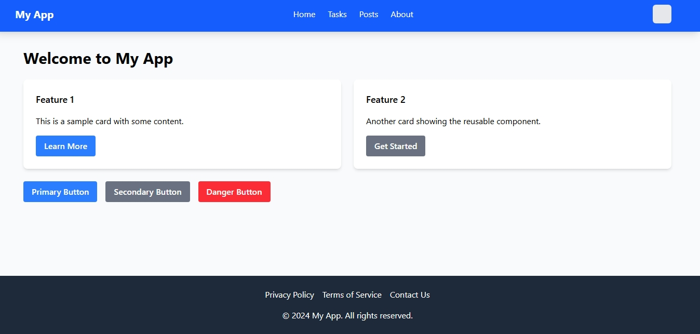
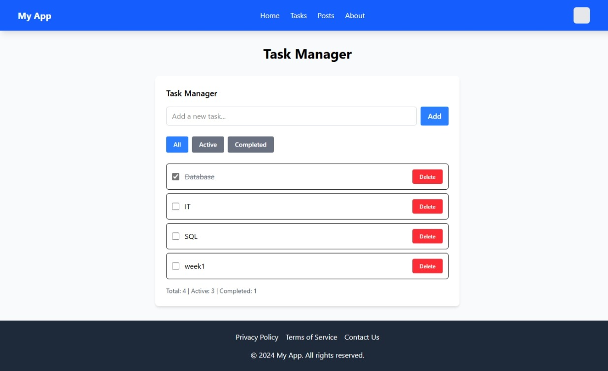

# My React App - Setup & Guide

A modern React application built with Vite, featuring task management, blog posts, dark/light theme, and responsive design.

## 🚀 Quick Setup

## My deployement Url

## My application on my browser


### 1. Create the Project
```bash
# Navigate to your project folder
cd "C:\Users\LENOVO\Documents\wk3_mern\week-3-react-js-assignment-Maggy6973"

# Create React app with Vite
npm create vite@latest my-react-app -- --template react
cd my-react-app
npm install
```

### 2. Install Dependencies
```bash
# Install Tailwind CSS
npm install -D tailwindcss postcss autoprefixer
npx tailwindcss init -p

# Install React Router
npm install react-router-dom
```

### 3. Create Project Folders
```bash
mkdir src\components
mkdir src\components\ui
mkdir src\components\layout
mkdir src\pages
mkdir src\contexts
mkdir src\hooks
mkdir src\services
mkdir src\utils
```

### 4. Configure Tailwind CSS

**Update `tailwind.config.js`:**
```javascript
export default {
  content: ["./index.html", "./src/**/*.{js,ts,jsx,tsx}"],
  darkMode: 'class',
  theme: { extend: {} },
  plugins: [],
}
```

**Replace `src/index.css` content:**
```css
@tailwind base;
@tailwind components;
@tailwind utilities;
```

### 5. Run the Project
```bash
npm run dev
```

## 📁 Project Structure

```
my-react-app/
├── src/
│   ├── components/
│   │   ├── ui/              # Reusable components
│   │   │   ├── Button.jsx
│   │   │   ├── Card.jsx
│   │   │   └── ThemeSwitcher.jsx
│   │   ├── layout/          # Layout components
│   │   │   ├── Layout.jsx
│   │   │   ├── Navbar.jsx
│   │   │   └── Footer.jsx
│   │   ├── TaskManager.jsx  # Task management
│   │   └── PostList.jsx     # Blog posts
│   ├── pages/               # Page components
│   │   ├── Home.jsx
│   │   ├── Tasks.jsx
│   │   ├── Posts.jsx
│   │   └── About.jsx
│   ├── contexts/            # React contexts
│   │   └── ThemeContext.jsx
│   ├── hooks/               # Custom hooks
│   │   └── useLocalStorage.js
│   ├── services/            # API services
│   │   └── api.js
│   └── App.jsx              # Main app component
```

## 🎯 How It Works

### **Navigation**
- Click navigation links to switch between pages
- Responsive design adapts to mobile/desktop
- Active page highlighted in navigation

### **Theme Switching**
- Click sun/moon icon to toggle dark/light mode
- Theme preference saved in localStorage
- All components adapt to theme changes

### **Task Manager** (`/tasks`)
- **Add tasks**: Type in input field and click "Add" or press Enter
- **Complete tasks**: Check the checkbox to mark as done
- **Filter tasks**: Click "All", "Active", or "Completed" buttons
- **Delete tasks**: Click red "Delete" button
- **Stats**: View task counts at bottom

### **Blog Posts** (`/posts`)
- Fetches posts from JSONPlaceholder API
- **Search**: Type in search box to filter posts
- **Load More**: Click button to load additional posts
- **Error Handling**: Shows errors if API fails

### **Responsive Design**
- Mobile-first approach
- Grid layouts adapt to screen size
- Touch-friendly buttons and interactions

## 🛠️ Key Technologies

- **React 18** - UI library
- **Vite** - Build tool
- **React Router** - Navigation
- **Tailwind CSS** - Styling
- **Context API** - State management
- **Custom Hooks** - Reusable logic
- **LocalStorage** - Data persistence

## 📦 Components Explained

### **UI Components** (`src/components/ui/`)
- `Button.jsx` - Reusable button with variants (primary, secondary, danger)
- `Card.jsx` - Container component with title and content
- `ThemeSwitcher.jsx` - Dark/light mode toggle button

### **Layout Components** (`src/components/layout/`)
- `Layout.jsx` - Main page wrapper with navbar and footer
- `Navbar.jsx` - Top navigation with links and theme switcher
- `Footer.jsx` - Bottom footer with links and copyright

### **Feature Components**
- `TaskManager.jsx` - Complete task management system
- `PostList.jsx` - Blog posts with search and pagination

### **Pages** (`src/pages/`)
- `Home.jsx` - Landing page with feature cards
- `Tasks.jsx` - Task management page
- `Posts.jsx` - Blog posts page
- `About.jsx` - About page

## 🔧 Customization

### **Add New Page**
1. Create component in `src/pages/NewPage.jsx`
2. Add route in `src/App.jsx`:
   ```jsx
   <Route path="/newpage" element={<NewPage />} />
   ```
3. Add link in `src/components/layout/Navbar.jsx`

### **Modify Colors**
- Edit `tailwind.config.js` to add custom colors
- Use Tailwind classes like `bg-blue-500`, `text-red-600`

### **Add New Features**
- Follow the existing component structure
- Use custom hooks for reusable logic
- Add to appropriate folders

## 🚨 Troubleshooting

### **Build Errors**
- Make sure all dependencies are installed: `npm install`
- Check that all imports are correct
- Ensure Tailwind config matches file structure

### **Routing Issues**
- Verify React Router is installed
- Check route paths match navigation links
- Ensure `BrowserRouter` wraps the app

### **Styling Problems**
- Confirm Tailwind CSS is properly configured
- Check `index.css` has Tailwind directives
- Verify class names are correct

### **API Issues**
- Check internet connection for JSONPlaceholder API
- Look for error messages in browser console
- Verify API service functions work correctly

## 🎉 Features Included

✅ **Modern React Setup** with Vite  
✅ **Responsive Design** (mobile, tablet, desktop)  
✅ **Dark/Light Theme** with persistence  
✅ **Task Management** (add, complete, delete, filter)  
✅ **Blog Posts** with search and pagination  
✅ **Navigation** with React Router  
✅ **Component Architecture** with reusable components  
✅ **State Management** with hooks and context  
✅ **API Integration** with error handling  
✅ **Local Storage** for data persistence  
✅ **Animations** and smooth transitions  

## 📞 Need Help?

1. Check browser console for error messages
2. Verify all files are in correct folders
3. Make sure dependencies are installed
4. Test each feature individually
5. Check network tab for API requests

---

**Ready to go!** Run `npm run dev` and start exploring your React application! 🚀


[](https://classroom.github.com/online_ide?assignment_repo_id=19815797&assignment_repo_type=AssignmentRepo)
# React.js and Tailwind CSS Assignment

This assignment focuses on building a responsive React application using JSX and Tailwind CSS, implementing component architecture, state management, hooks, and API integration.

## Assignment Overview

You will:
1. Set up a React project with Vite and Tailwind CSS
2. Create reusable UI components
3. Implement state management using React hooks
4. Integrate with external APIs
5. Style your application using Tailwind CSS

## Getting Started

1. Accept the GitHub Classroom assignment invitation
2. Clone your personal repository that was created by GitHub Classroom
3. Install dependencies:
   ```
   npm install
   ```
4. Start the development server:
   ```
   npm run dev
   ```

## Files Included

- `Week3-Assignment.md`: Detailed assignment instructions
- Starter files for your React application:
  - Basic project structure
  - Pre-configured Tailwind CSS
  - Sample component templates

## Requirements

- Node.js (v18 or higher)
- npm or yarn
- Modern web browser
- Code editor (VS Code recommended)

## Project Structure

```
src/
├── components/       # Reusable UI components
├── pages/           # Page components
├── hooks/           # Custom React hooks
├── context/         # React context providers
├── api/             # API integration functions
├── utils/           # Utility functions
└── App.jsx          # Main application component
```

## Submission

Your work will be automatically submitted when you push to your GitHub Classroom repository. Make sure to:

1. Complete all required components and features
2. Implement proper state management with hooks
3. Integrate with at least one external API
4. Style your application with Tailwind CSS
5. Deploy your application and add the URL to your README.md

## Resources

- [React Documentation](https://react.dev/)
- [Tailwind CSS Documentation](https://tailwindcss.com/docs)
- [Vite Documentation](https://vitejs.dev/guide/)
- [React Router Documentation](https://reactrouter.com/) 